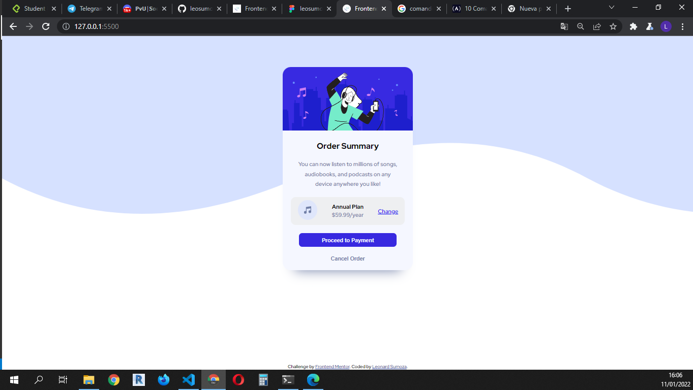

# Frontend Mentor - Order summary card solution

This is a solution to the [Order summary card challenge on Frontend Mentor](https://www.frontendmentor.io/challenges/order-summary-component-QlPmajDUj). Frontend Mentor challenges help you improve your coding skills by building realistic projects. 

## Table of contents

- [Overview](#overview)
  - [The challenge](#the-challenge)
  - [Screenshot](#screenshot)
  - [Links](#links)
- [My process](#my-process)
  - [Built with](#built-with)
  - [What I learned](#what-i-learned)  
- [Author](#author)

## Overview

### The challenge

Challenge is to build out this order summary card component and get it looking as close to the design as possible.
like  hover states for interactive elements.

### Screenshot

### Links

- Solution URL: [https://leosumoza87.github.io/order-summary-component-main/]

## My process

### Built with

- Semantic HTML5 markup
- CSS custom properties
- Flexbox
- CSS Grid
- Mobile-first workflow
- Preprocess : PUG and Stylus

### What I learned

With this web design challenge, continue to practice HTML and CSS, this time supported by the PUG and Stylus preprocessors.
Finally, the basic knowledge of the handling of git and github is reinforced

## Author

- Frontend Mentor - [@leosumoza87](https://www.frontendmentor.io/profile/leosumoza87)
- Twitter - [@leosumoza87](https://twitter.com/leosumoza87)

